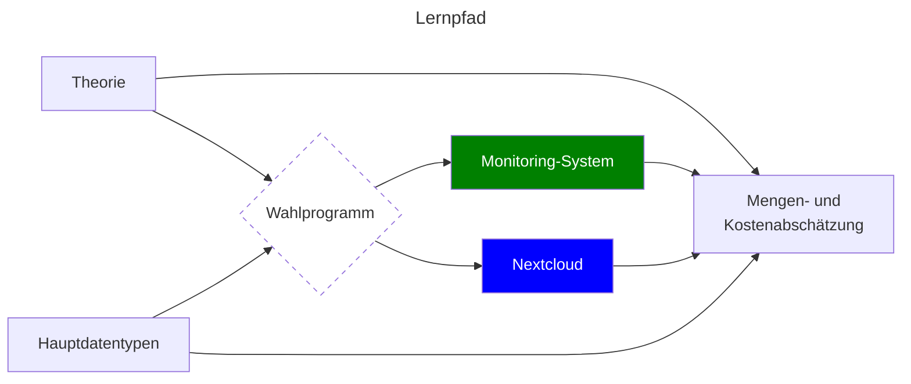

+++
archetype = "home"
title = "Modul 346: Cloud-Lösungen konzipieren und realisieren"
+++

Willkommen beim Modul 346!

# Ablauf

```mermaid
---
title: Lernpfad
---
graph LR;
    theorie[Theorie] --> kosten[Mengen- und<br>Kostenabschätzung]
    theorie --> wahl{Wahlprogramm}
    datentypen[Hauptdatentypen] --> wahl
    wahl --> monitoring[Monitoring-System]
    wahl --> nextcloud[Nextcloud]
    monitoring --> kosten
    nextcloud --> kosten
    datentypen --> kosten

    style monitoring fill:green,color:white
    style nextcloud fill:blue,color:white
    style wahl fill:white,stroke-dasharray: 5 5
```
