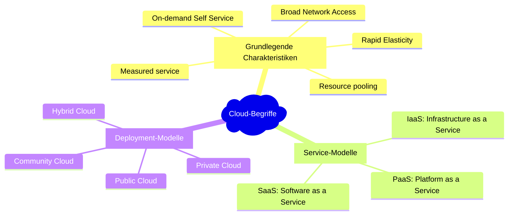

+++
title = "Definition"
+++

## Überblick

Cloud Computing ist ein Modell zur Ermöglichung eines allgegenwärtigen
(*ubiquitous*), bequemen (*convenient*) und bedarfsorientierten
(*on-demand*) Netwerkzugriffs zu einer geteilten Ansammlung von
konfigurierbaren Rechenkapazitäten (*shared pool of configurable
computing resources*, z.B. Netzwerke, Server, Datenspeicher, Anwendungen
und Dienste), welche schnell und mit minimalem Verwaltungsaufwand oder
Interaktion mit dem Dienstanbieter bereitgestellt und freigegeben werden
können.[^1]

## Grundlegende Charakteristiken

- **On-Demand Self-Service**: *Selbstbedienung nach Bedarf*: Ein Abnehmer kann von
  sich aus (*unilaterally*), nach Bedarf und automatisch Rechenkapazitäten
  bereitstellen, wie etwa Rechenzeit eines Servers (*server time*) oder
  Netzwerkspeicher, ohne dass dies persönliche Interaktion mit einem der
  jeweiligen Dienstanbieter erforderte.
- **Broad Network Access**: *Umfassender Netzwerkzugriff*: Ressourcen
  (*capabilities*) stehen über das Netzwerk zur Verfügung, worauf über
  Standardmechanismen, welche die Verwendung heterogener Thin- oder
  Thick-Client-Plattformen (Smartphones, Tablets, Laptops, Arbeitstationen)
  fördern, zugegriffen werden kann.
- **Resource Pooling**: *Ressourcenzusammenschluss*: Die Rechenkapazitäten eines
  Anbieters werden zusammengeschlossen, um mehreren Abnehmern in einem
  mandantenfähigen Modell (*multi-tenant model*) angeboten werden zu können,
  wobei verschiedene physische und virtuelle Ressourcen entsprechend dem
  Nutzungsbedarf dynamisch zugewiesen (*assigned*) und übereignet
  (*re-assigned*) werden können. Es besteht eine gewisse Ortsunabhängigkeit,
  insofern ein Kunde grundsätzlich weder Kontrolle noch Wissen über den genauen
  Ort der bereitgestellten Ressource hat, jedoch über die Möglichkeit verfügt
  den Ort auf einer höheren Abstraktionsebene (z.B. Land, Region, Rechenzentrum)
  vorzugeben. Beispiele für Ressourcen sind Speicherplatz, Prozessorleistung,
  Arbeitsspeicher und Netzwerkbandbreite.
- **Rapid Elasticity**: *Schnelle Anpassungsfähigkeit*: Ressourcen können
  elastisch bereitgestellt und freigegeben werden, in manchen Fällen
  automatisch, um schnell innerlich und äusserlich dem Bedarf entsprechend zu
  skalieren. Für den Verbraucher erscheinen die Resourcen, die bereitgestellt
  werden können, oftmals als unerschöpflich und können in beliebiger Menge zu
  beliebiger Zeit in Anspruch genommen werden.
- **Measured Service**: *Gemessener Dienst*: Cloud-Systeme kontrollieren und
  optimieren die Verwendung von Ressourcen mithilfe einer Messeinrichtung
  (*metering capability*[^2]) auf einer der Art von Dienst entsprechenden
  Abstraktionsstufe (z.B. Speicherplatz, Prozessorleistung, Bandbreite, Anzahl
  aktive Benutzerkonten). Die Ressourcennutzung kann überwacht, kontrolliert und
  rapportiert werden, was sowohl für Anbieter als auch für Abnehmer Transparenz
  im Hinblick auf die genutzten Dienste schafft.

## Service-Modelle

- **Software as a Service (SaaS)**: Die dem Abnehmer zur Verfügung gestellte
  Ressource ist die Nutzung von Anwendungen des Anbieters, welche auf einer
    Cloud-Infrastruktur[^3] ausgeführt werden. Die Anwendungen sind von
    verschiedenen Clientgeräten über entweder eine Thin-Client-Schnittstelle wie
    ein Webbrowser (z.B. web-basiertes E-Mail), oder eine Programmschnittstelle
    (*program interface*) zugreifbar. Weder verwaltet noch kontrolliert der
    Abnehmer die zugrundeliegende Cloud-Infrastruktur bestehend aus Netzwerk,
    Servern, Betriebssystemen, Datenspeicher oder gar einzelne
    Anwendungsressourcen ‒ mit der möglichen Ausnahme von eingeschränkten,
    benutzerspezifischen Konfigurationseinstellungen der Anwendung.
- **Platform as a Service (PaaS)**: Die dem Abnehmer zur Verfügung gestellte
  Ressource ist das Verteilen von Anwendungen (durch den Abnehmer erstellt oder
  erworben), welche mithilfe von Programmiersprachen, Programmbibliotheken,
  Diensten und Werkzeugen, die vom Anbieter unterstützt werden[^4], auf die
  Cloud-Infrastruktur. Weder verwaltet noch kontrolliert der Abnhemer die
  zugrundeliegende Cloud-Infrastruktur bestehend aus Netzwerk, Servern,
  Betriebssystemen, Datenspeicher ‒ hat jedoch Kontrolle über die verteilten
  Anwendungen und möglicherweise über die Konfigurationseinstellungen für die
  Hosting-Umgebung der Anwendungen.
- **Infrastructure as a Service (IaaS)**: Die dem Abnehmer zur Verfügung
  gestellte Ressource ist die Möglichkeit zur Bereitstellung von Prozessor-,
  Speicher-, Netzwerk- sowie anderer grundlegender Rechenkapazitäten, worauf der
  Abnehmer beliebige Software ausliefern und betreiben kann, was etwa
  Betriebssysteme und Anwendungen umfasst. Weder verwaltet noch kontrolliert der
  Abnehmer die zugrundeliegende Cloud-Infrastruktur, hat jedoch Kontrolle über
  Betriebssysteme, Datenspeicher und verteilte Anwendungen ‒ und möglicherweise
  eingeschränkte Kontrolle auf vorgegebene Netzwerkkomponenten (z.B. auf die
  Firewalls der einzelnen Hosts).

## Deployment-Modelle

- **Private Cloud**: Die Cloud-Infrastruktur wird für den Exklusivgebrauch einer
  einzigen Organisation bestehend aus mehreren Abnehmern (z.B.
  Unternehmensbereichen) bereitgestellt. Sie kann von der Organisation selber,
  einer Drittpartei oder einer Kombination daraus besessen, verwaltet und
  betrieben werden, und sie kann sich innerhalb oder ausserhalb des Geländes der
  Organisation (*on-premise*/*off-premise*) befinden.
- **Community Cloud**: Die Cloud-Infrastruktur wird für den Exklusivgebrauch
  einer Gesellschaft von Abnehmern verschiedener Organisationen mit gemeinsamen
  Anliegen (z.B. Auftrag, Sicherheitsanforderungen, Richtlinien und
  Compliance-Bedürfnissen) bereitgestellt. Sie kann von einer oder mehreren
  Organisationen dieser Gesellschaft, einer Drittpartei oder einer Kombination
  daraus besessen, verwaltet und betrieben werden, und sie kann sich in- oder
  ausserhalb des Geländes der Gesellschaft befinden.
- **Public Cloud**: Die Cloud-Infrastruktur wird für die offene Verwendung der
  breiten Öffentlichkeit bereitgestellt. Sie kann von einer Firma, einer
  akademischen bzw.  Regierungsorganisation oder einer Kombination daraus
  besessen, verwaltet und betrieben werden. Sie befindet sich auf dem Gelände
  des Cloud-Anbieters.
- **Hybrid Cloud**: Die Cloud-Infrastruktur setzt sich aus zwei oder mehreren
  verschiedenen Cloud-Infrastrukturen (*private*, *community* oder *public*)
  zusammen, die einzigartige Einheiten bleiben, jedoch von einer
  standardisierten oder proprietären Technologie miteinander verbunden werden,
  welche Portabilität der Daten und Anwendungen ermöglicht, z.B. *Cloud
  Bursting* für den Lastausgleich (*load-balancing*) zwischen den Clouds.

[^1]: Originalquelle: *The NIST Definition of Cloud Computing*.  Webseite:
    <https://csrc.nist.gov/publications/detail/sp/800-145/final>, PDF:
    <https://nvlpubs.nist.gov/nistpubs/Legacy/SP/nistspecialpublication800-145.pdf>,
    (S. 6-7) Hierbei handelt es sich um eine unautorisierte Übersetzung. Die
    selben Begriffe im Original wurden je nach Kontext und Bedarf anders
    übersetzt. Bei ambivalenten Übersetzungen wird der englische Originalbegriff
    in Klammern und kursivgesetzt angegeben.

[^2]: Typischerweise wird dies auf einer *pay-per-use*- oder
    *charge-per-use*-Basis gemacht.

[^3]: Eine Cloud-Infrastruktur ist eine Sammlung von Hardware und Software,
    welche die fünf grundlegenden Charakteristiken von Cloud Computing
    ermöglicht. Die Cloud-Infrastruktur kann so angesehen werden, dass sie
    sowohl eine physische Ebene als auch eine Abstraktionsebene umfasst. Die
    physische Ebene umfasst die Hardware-Ressourcen, die notwendig sind, um die
    angebotenen Cloud-Dienste zu tragen, und beinhalten üblicherweise Server,
    Datenspeicher und Netzwerkkompontenten. Die Abstraktionsebene umfasst die
    Software, welche über die physische Ebene verteilt wird, und die
    grundlegenden Charakteristiken der Cloud ausmacht.  Konzeptionell liegt die
    Abstraktionsebene oberhalb der physischen Ebene.

[^4]: Diese Möglichkeit schliesst nicht zwingend die Verwendung von kompatiblen
    Programmiersprachen, Programmbibliotheken, Diensten und Werkzeuge aus
    anderen Quellen aus.
