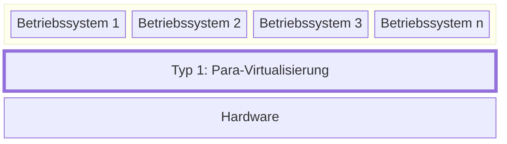
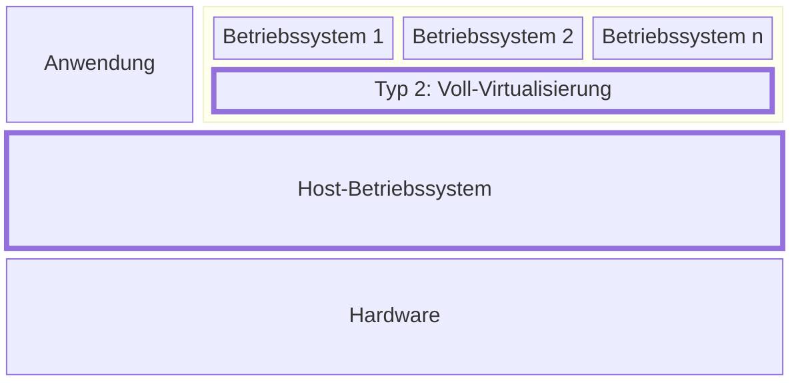

+++
title = "Virtuelle Maschinen, Container und Serverless Computing"
+++

Ein wichtiger Vorteil von Cloud Computing gegenüber dem eigenen Betrieb einer
Serverinfrastruktur ist die schnelle Skalierung: Die zur Ressourcen können mit
steigendem Bedarf schnell hochgefahren ‒ und bei sinkendem Bedarf auch wieder
heruntergefahren werden. Sogenannte _Compute_-Optionen stellen Rechenleistung
zur Verfügung: eine Ressource, deren Bedarf starken Schwankungen unterliegen
kann. Verschiedene Arten von Compute-Angeboten skalieren dabei unterschiedlich.

## Virtuelle Maschinen

Bei der Virtualisierung wird eine _virtuelle Realität_ erzeugt und auf einer
_physischen Realität_ abgebildet. Im Kontext von virtuellen Maschinen bedeutet
dies, dass mehrere virtuelle Computer mit einem Betriebssystem auf einen
physischen Computer abgebildet werden. Im Bezug auf den Betrieb virtueller
Server dient das folgenden Zwecken:

1. **Multiplizität**: Auf einem physischen Server können mehrere virtuelle
   Server laufen.
2. **Entkopplung**: Virtuelle Server sind nicht an den physischen Server
   gebunden und können auf einen anderen physischen Server verschoben werden.
3. **Isolation**: Ein virtueller Server kann keine anderen virtuellen Server
   beeinflussen, die auf dem gleichen physischen Server laufen.

Physische Ressourcen wie Prozessor-Kerne (CPU), Arbeitsspeicher (RAM) und
persistenter Speicherplatz (SSD, HDD) werden auf die laufenden virtuellen
Maschinen verteilt, welche sich u.a. auch die Netzwerk-Bandbreite teilen, von
welcher sie über virtuelle Netzwerkschnittstellen Gebrauch machen.

Man unterscheidet zwischen zwei Arten von Virtualisierung:

1. Die _Typ-1-Virtualisierung_ oder _Para-Virtualisierung_, welche ohne
   Host-Betriebssystem auskommt.
2. Die _Typ-2-Virtualisierung_ oder _Voll-Virtualisierung_, welche mit einem
   Host-Betriebssystem arbeitet.

Bei beiden Arten der Virtualisierung läuft ein sogenannter _Hypervisor_, welcher
den Gast-Betriebssystemen die Systemressourcen zur Verfügung stellt.

### Typ-1-Virtualisierung: Para-Virtualisierung

Bei der Para-Virtualisierung läuft der Hypervisor direkt auf der Hardware.
Das Gast-Betriebssystem benötigt hierzu spezielle Treiber, damit es auf dem
Hypervisor laufen kann.

Dadurch können nur spezialisierte Betriebssysteme als Gast auf diesem Hypervisor
laufen. Die Performance-Einbusse durch diese Art der Virtualisierung ist aber
mit weniger als 5% sehr gering.

Beispiele für Para-Virtualisierung sind _VMware ESXi_, _Microsoft Hyper-V_ und
_KVM_.

### Typ-2-Virtualisierung: Voll-Virtualisierung

Bei der Voll-Virtualisierung läuft der Hypervisor auf einem Host-Betriebssystem.
Das Gast-Betriebssystem kommt dabei ohne spezielle Treiber aus.

Dadurch können praktisch beliebige Betriebssysteme als Gast auf diesem
Hypervisor laufen. Die Performance-Einbusse ist dadurch etwas höher als bei der
Para-Virtualisierung, sollte aber weniger als 10% betragen. Da ein vollwertiges
Betriebssystem auf der Hardware installiert wird, können neben den
Gast-Betriebssystemen noch andere Anwendungen ausgeführt werden.

Beispiele für Voll-Virtualisierung sind _Oracle VirtualBox_, _VMWare
Workstation_ und _Microsoft Virtual PC_.

## Container

TODO

## Serverless Computing

TODO

## Vor- und Nachteile

TODO

## Quellen

- Nane Kratzke: [Cloud-Native
  Computing](https://www.hanser-fachbuch.de/fachbuch/artikel/9783446479142).
  Software Engineering von Diensten und Applikationen für die Cloud
  (Hanser-Verlag, 2024). ISBN-13: 978-3-446-47914-2
    - Kapitel 7: Infrastructure as Code
        - Kapitel 7.1: Virtualisierung
    - Kapitel 8: Standardisierung von Deployment Units (Container)
    - Kapitel 9: Container-Plattformen
    - Kapitel 10: Function as a Service
