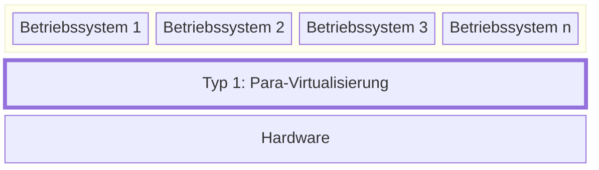
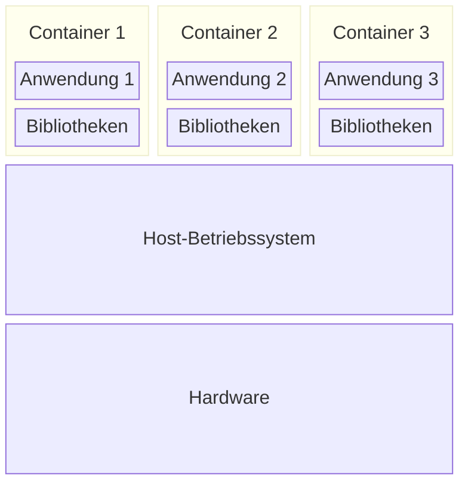

+++
title = "Virtuelle Maschinen, Container und Serverless Computing"
+++

Ein wichtiger Vorteil von Cloud Computing gegenüber dem eigenen Betrieb einer
Serverinfrastruktur ist die schnelle Skalierung: Die zur Ressourcen können mit
steigendem Bedarf schnell hochgefahren ‒ und bei sinkendem Bedarf auch wieder
heruntergefahren werden. Sogenannte _Compute_-Optionen stellen Rechenleistung
zur Verfügung: eine Ressource, deren Bedarf starken Schwankungen unterliegen
kann. Verschiedene Arten von Compute-Angeboten skalieren dabei unterschiedlich.

## Virtuelle Maschinen

Bei der Virtualisierung wird eine _virtuelle Realität_ erzeugt und auf einer
_physischen Realität_ abgebildet. Im Kontext von virtuellen Maschinen bedeutet
dies, dass mehrere virtuelle Computer mit einem Betriebssystem auf einen
physischen Computer abgebildet werden. Im Bezug auf den Betrieb virtueller
Server dient das folgenden Zwecken:

1. **Multiplizität**: Auf einem physischen Server können mehrere virtuelle
   Server laufen.
2. **Entkopplung**: Virtuelle Server sind nicht an den physischen Server
   gebunden und können auf einen anderen physischen Server verschoben werden.
3. **Isolation**: Ein virtueller Server kann keine anderen virtuellen Server
   beeinflussen, die auf dem gleichen physischen Server laufen.

Physische Ressourcen wie Prozessor-Kerne (CPU), Arbeitsspeicher (RAM) und
persistenter Speicherplatz (SSD, HDD) werden auf die laufenden virtuellen
Maschinen verteilt, welche sich u.a. auch die Netzwerk-Bandbreite teilen, von
welcher sie über virtuelle Netzwerkschnittstellen Gebrauch machen.

Man unterscheidet zwischen zwei Arten von Virtualisierung:

1. Die _Typ-1-Virtualisierung_ oder _Para-Virtualisierung_, welche ohne
   Host-Betriebssystem auskommt.
2. Die _Typ-2-Virtualisierung_ oder _Voll-Virtualisierung_, welche mit einem
   Host-Betriebssystem arbeitet.

Bei beiden Arten der Virtualisierung läuft ein sogenannter _Hypervisor_, welcher
den Gast-Betriebssystemen die Systemressourcen zur Verfügung stellt.

### Typ-1-Virtualisierung: Para-Virtualisierung

Bei der Para-Virtualisierung läuft der Hypervisor direkt auf der Hardware.
Das Gast-Betriebssystem benötigt hierzu spezielle Treiber, damit es auf dem
Hypervisor laufen kann.

Dadurch können nur spezialisierte Betriebssysteme als Gast auf diesem Hypervisor
laufen. Die Performance-Einbusse durch diese Art der Virtualisierung ist aber
mit weniger als 5% sehr gering.

Beispiele für Para-Virtualisierung sind _VMware ESXi_, _Microsoft Hyper-V_ und
_KVM_.

### Typ-2-Virtualisierung: Voll-Virtualisierung

Bei der Voll-Virtualisierung läuft der Hypervisor auf einem Host-Betriebssystem.
Das Gast-Betriebssystem kommt dabei ohne spezielle Treiber aus.

Dadurch können praktisch beliebige Betriebssysteme als Gast auf diesem
Hypervisor laufen. Die Performance-Einbusse ist dadurch etwas höher als bei der
Para-Virtualisierung, sollte aber weniger als 10% betragen. Da ein vollwertiges
Betriebssystem auf der Hardware installiert wird, können neben den
Gast-Betriebssystemen noch andere Anwendungen ausgeführt werden.

Beispiele für Voll-Virtualisierung sind _Oracle VirtualBox_, _VMWare
Workstation_ und _Microsoft Virtual PC_.

## Serverless Computing: Function as a Service (FaaS)

TODO

## Container (as a Service, CaaS)

Verglichen mit Paas-Angeboten sind Container besser portabel und somit weniger
allfällig für einen _Vendor Lock-in_. _Container as a Service_ kann als Managed
Service von einer Public Cloud bezogen oder als self-hsoted Service im Rahmen
einer Private Cloud zur Verfügung gestellt werden. Das CaaS-Modell dürfte das
PaaS-Modell aufgrund besserer Portierbarkeit und weniger Anbieterabhängigkeit
zusehends verdrängen.

Im Gegensatz zu virtuellen Maschinen kommt keine keine Para- (Typ 1) oder
Voll-Virtualisierung (Typ 2) sondern eine _Betriebssystemvirtualisierung_ zum
Einsatz:

Da hierbei keine Hypervisor-Schicht nötig ist, entfällt der Overhead, sodass
Container wesentlich ressourcenschonender betrieben werden können als virtuelle
Maschinen. Eine Isolation (Prozess-Namensraum, Dateisystem, Benutzer) sowie
Ressourcenbegrenzung (Prozessorleistung, Arbeitsspeicher, Speicherplatz) ist
trotzdem möglich.

Container sind das Thema der Module
[347](https://www.modulbaukasten.ch/module/347/1/de-DE?title=Dienst-mit-Container-anwenden)
(Applikationsentwicklung) bzw.
[169](https://www.modulbaukasten.ch/module/169/1/de-DE?title=Services-mit-Containern-bereitstellen)
(Plattformentwicklung) und werden an dieser Stelle nicht weiter vertieft.

## IaaS und PaaS: Vor- und Nachteile

Zur Erinnerung:

- SaaS-Angebote erfordern Anwenderkenntnisse.
- PaaS-Angebote erfordern Entwicklerkenntnisse.
- IaaS-Angebote erfordern Systemadministratorenkenntnisse.

Die verschiedenen Service-Modelle erfordern ein unterschiedliches Ausmass an
Wissen und Fähigkeiten. Dabei muss man bedenken, dass das Fehlen der
entsprechenden Fähigkeiten sowohl als Vorteil (man braucht sich weniger Wissen
anzueignen) als auch als Nachteil (im Bedarfsfall verfügt man nicht über das
notwendige Wissen) gesehen werden kann.

| Was wird selber gemacht? |      Legacy IT     |        IaaS        |        PaaS        | SaaS |
|--------------------------|:------------------:|:------------------:|:------------------:|:----:|
| Applikationen            | :white_check_mark: | :white_check_mark: | :white_check_mark: |  :x: |
| Sicherheit               | :white_check_mark: | :white_check_mark: |         :x:        |  :x: |
| Datenbanken              | :white_check_mark: | :white_check_mark: |         :x:        |  :x: |
| Betriebssysteme          | :white_check_mark: | :white_check_mark: |         :x:        |  :x: |
| Virtualisierung          | :white_check_mark: |         :x:        |         :x:        |  :x: |
| Server                   | :white_check_mark: |         :x:        |         :x:        |  :x: |
| Speicher (Storage)       | :white_check_mark: |         :x:        |         :x:        |  :x: |
| Netzwerk                 | :white_check_mark: |         :x:        |         :x:        |  :x: |
| Rechenzentrum            | :white_check_mark: |         :x:        |         :x:        |  :x: |

Geht man eine Stufe höher in der Pyamide (Legacy IT :arrow_right: IaaS
:arrow_right: PaaS :arrow_right: SaaS), verliert man dabei Wissen, wodurch der
Schritt nach unten in der Pyramide (SaaS :arrow_right: PaaS :arrow_right: IaaS
:arrow_right: Legacy IT) schwieriger wird und mit einen enormen
Wissens(wieder)aufbau erfordert.

Virtuelle Maschinen sind Angebote auf der Ebene _Infrastructure as a Service_
(IaaS) und können von allen grossen Cloud-Providern bezogen werden. Die
Deployment-Einheiten (VM-Images) sind dabei sehr gross und liegen im
Gigabyte-Bereich. Die Startzeiten eines kompletten Betriebssystems liegen im
Minutenbereich und sind damit recht hoch.

Eine schlankere Alternative hierzu sind Angebote auf der Ebene _Platform as a
Service_ (PaaS) wie z.B. die _Google App Engine_ oder _Heroku_. Im Gegensatz zu
IaaS-Angeboten erhält man hierbei keinen Zugriff auf der Betriebssystem-Ebene,
sondern auf eine Laufzeit- und Entwicklungsumgebung. Die Anwendung kann
automatisch skalieren und bietet zusätzlich Schnittstellen zur Administration
und fürs Monitoring der Anwendung.

PaaS-Angebote locken oft mit kostenfreien Einstiegsangeboten, die zwar einen
hohen Funktionsumfang bieten, aber Einschränkungen im Volumen (Anzahl laufender
Instanzen, Anzahl behandelter Anfragen, verfügbare CPU-Ressourcen pro Instanz
usw.) Auf diese Weise kann sich der Kunde mit der Plattform vertraut machen, und
der Anbieter kann eine Bindung zum Kunden aufbauen. Da PaaS-Plattformen
verschiedener Hersteller weitgehend imkompatibel zueinander sind und bei der
Migration von einem Anbieter zum anderen Anpassungen auf der Anwendungsebene
erfordern, stellt der Wechsel des Anbieters eine grosse technische Hürde dar.
Hierbei spricht man vom _Vendor Lock-in_: als Abnehmer ist man an einen Anbieter
gebunden.

PaaS-Angebote unterliegen oft technische Einschränkungen:

- Es dürfen nicht alle Funktionen der Standardbibliothek verwendet werden wie
  etwa das Starten von Threads.
- Der Zugriff auf die Laufzeitumgebung ist eingeschränkt.
- Es gibt Grössen- und Zeitlimitierungen bei Anfragen und Antworten.
- Die Anwendung muss für bestimmte Funktionen auf anbieterspezifische
  Bibliotheken zurückgreifen.

## Quellen

- Nane Kratzke: [Cloud-Native
  Computing](https://www.hanser-fachbuch.de/fachbuch/artikel/9783446479142).
  Software Engineering von Diensten und Applikationen für die Cloud
  (Hanser-Verlag, 2024). ISBN-13: 978-3-446-47914-2
    - Kapitel 7: Infrastructure as Code
        - Kapitel 7.1: Virtualisierung
    - Kapitel 8: Standardisierung von Deployment Units (Container)
    - Kapitel 9: Container-Plattformen
    - Kapitel 10: Function as a Service
