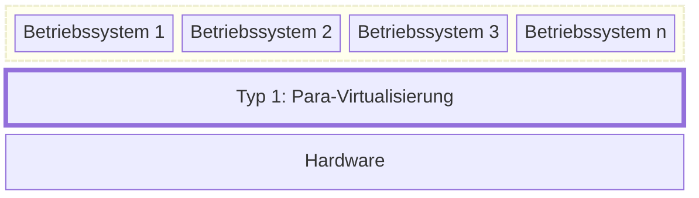
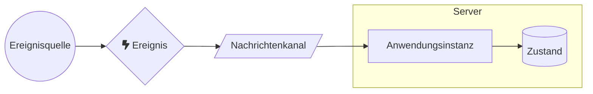
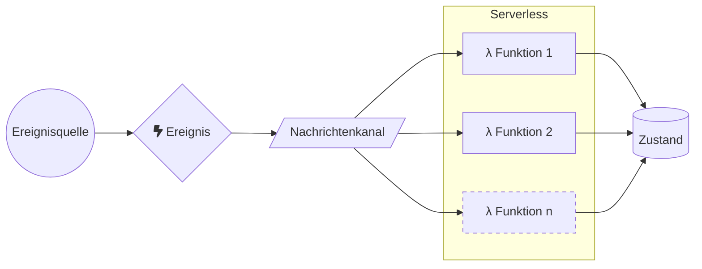
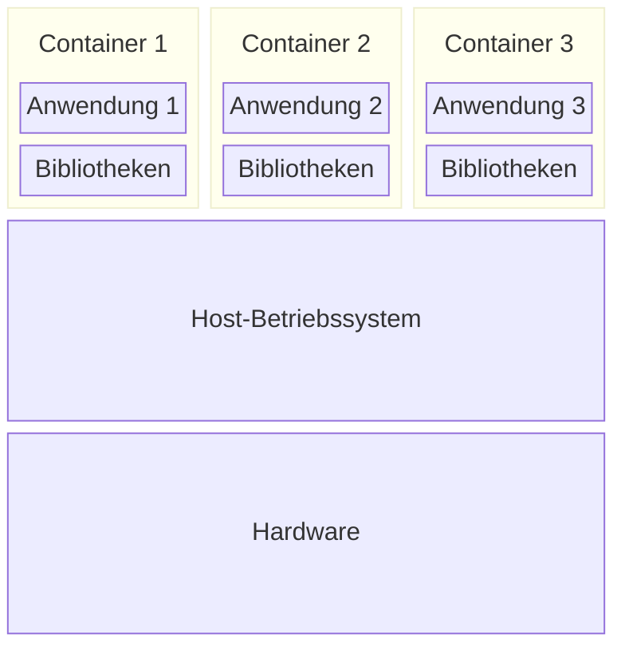

+++
title = "Virtuelle Maschinen, Container und Serverless Computing"
+++

Ein wichtiger Vorteil vom Cloud Computing gegenüber dem eigenen Betrieb der
Serverinfrastruktur ist die schnelle Skalierung: Die Ressourcen können mit
steigendem Bedarf schnell hochgefahren ‒ und bei sinkendem Bedarf auch wieder
heruntergefahren werden. Sogenannte _Compute_-Optionen stellen Rechenleistung
zur Verfügung: eine Ressource, deren Bedarf starken Schwankungen unterliegen
kann. Verschiedene Arten von Compute-Angeboten skalieren dabei unterschiedlich,
was auch einen Einfluss auf die anfallenden Kosten hat.

## Virtuelle Maschinen

Bei der Virtualisierung wird eine _virtuelle Realität_ erzeugt und auf eine
_physischen Realität_ abgebildet. Im Kontext von virtuellen Maschinen bedeutet
dies, dass mehrere virtuelle Computer mit einem Betriebssystem auf einen
physischen Computer abgebildet werden. Im Bezug auf den Betrieb virtueller
Server dient das folgenden Zwecken:

1. **Multiplizität**: Auf einem physischen Server können mehrere virtuelle
   Server laufen.
2. **Entkopplung**: Virtuelle Server sind nicht an den physischen Server
   gebunden und können auf einen anderen physischen Server verschoben werden.
3. **Isolation**: Ein virtueller Server kann keine anderen virtuellen Server
   beeinflussen, die auf dem gleichen physischen Server laufen.

Physische Ressourcen wie Prozessor-Kerne (CPU), Arbeitsspeicher (RAM) und
persistenter Speicherplatz (SSD, HDD) werden auf die laufenden virtuellen
Maschinen verteilt, welche sich u.a. auch die Netzwerk-Bandbreite teilen, von
welcher sie über virtuelle Netzwerkschnittstellen Gebrauch machen.

Man unterscheidet zwischen zwei Arten von Virtualisierung:

1. Die _Typ-1-Virtualisierung_ oder _Para-Virtualisierung_, welche ohne
   Host-Betriebssystem auskommt.
2. Die _Typ-2-Virtualisierung_ oder _Voll-Virtualisierung_, welche mit einem
   Host-Betriebssystem arbeitet.

Bei beiden Arten der Virtualisierung läuft ein sogenannter _Hypervisor_, welcher
den Gast-Betriebssystemen die Systemressourcen zur Verfügung stellt.

### Typ-1-Virtualisierung: Para-Virtualisierung

Bei der Para-Virtualisierung läuft der Hypervisor direkt auf der Hardware.
Das Gast-Betriebssystem benötigt hierzu spezielle Treiber, damit es auf dem
Hypervisor laufen kann.

Dadurch können nur spezialisierte Betriebssysteme als Gast auf diesem Hypervisor
laufen. Die Performance-Einbusse durch diese Art der Virtualisierung ist mit
weniger als 5% sehr gering.

Beispiele für Para-Virtualisierung sind _VMware ESXi_, _Microsoft Hyper-V_ und
_KVM_.

### Typ-2-Virtualisierung: Voll-Virtualisierung

Bei der Voll-Virtualisierung läuft der Hypervisor auf einem Host-Betriebssystem.
Das Gast-Betriebssystem kommt dabei ohne spezielle Treiber aus.

Dadurch können praktisch beliebige Betriebssysteme als Gast auf diesem
Hypervisor laufen. Die Performance-Einbusse ist dadurch etwas höher als bei der
Para-Virtualisierung, sollte aber weniger als 10% betragen. Da ein vollwertiges
Betriebssystem auf der Hardware installiert wird, können neben den
Gast-Betriebssystemen noch andere Anwendungen ausgeführt werden.

Beispiele für Voll-Virtualisierung sind _Oracle VirtualBox_, _VMWare
Workstation_ und _Microsoft Virtual PC_.

## Serverless Computing: Function as a Service (FaaS)

Verwendet man das IaaS-Modell, sprich virtuelle Maschinen, gestaltet sich der
Zugriff auf die Anwendungslogik und den dazugehörigen Zustand etwa
folgendermassen:

Von einer Ereignisquelle wird ein Ereignis ausgelöst, z.B. durch eine
Interaktion mit einer Web-Anwendung. Dieses gelangt über einen Nachrichtenkanal
an eine Anwendungsinstanz, die auf einem Server läuft. (Es könnte auch ein _Load
Balancer_ vorgelagert sein, der die Last glechmässig auf mehrere Server
verteilt.) Die Anwendung auf dem Server bedient die Anfrage, wozu der
persistente Zustand (etwa aus einer Datenbank) herbeigezogen bzw. manipuliert
wird.

Dieses Modell ist ‒ innerhalb und ausserhalb der Cloud ‒ weit verbreitet, hat
aber den Nachteil, dass die Anwendungsinstanz und der Server permanent laufen
müssen, auch wenn keine Anfragen zu beantworten sind. Dadurch entstehen laufend
Kosten (_Leerlaufkosten_), selbst wenn niemand die Anwendung verwendet.

Ausserdem muss die Serverinfrastruktur, sei sie nun virtuell oder physisch, zur
Verfügung gestellt und gewartet werden, was wiederum Kosten verursacht und
Wissen voraussetzt.

_Function as a Service_ (FaaS) oder _Serverless Computing_ ist eine Ausprägung
von _Platform as a Service_, bei der die Anwendungslogik in viele feingranulare
Funktionen aufgeteilt wird. Der Zugriff auf die Anwendungslogik sieht dabei
folgendermassen aus:

Die Berechnung wird wiederum über ein Ereignis ausgelöst, das über einen
Nachrichtenkanal eingeht. Die Anfrage wird nun aber von einer sogenannten
_Function_ oder _Funktion_ bedient, welche entweder bereits läuft oder hierzu
eigens gestartet wird. Dies kann als _Kaltstart_ erfolgen, wobei die
Funktionsinstanz komplett neu gestartet wird, oder als _Warmstart_, wobei eine
schlafenliegende Instanz "aufgeweckt" wird. (Ein Kaltstart kann mehrere Sekunden
dauern, ein Warmstart erfolgt in der Regel wesentlich schneller. Die Anfrage
wird um die entsprechende Anlaufzeit verzögert beantwortet.)

Werden keine Anfragen bedient, können alle Funktionen komplett herungergefahren
werden: Die Instanzen werden auf null herunterskaliert (_Scale to Zero_). Laufen
keine Instanzen, entstehen dem Kunden auch keine Kosten. Dadurch eignet sich
FaaS besonders für Anwendungen, die nur sporadisch verwendet werden. Auf eine
hohe Last kann schnell und automatisch durch das Aufstarten vieler
Funktionsinstanzen reagiert werden (_Rapid Elasticity_). Die Ressourcenzuweisung
richtet sich nach dem Bedarf. Dadurch entfällt aufseiten des Kunden sowohl die
Kapazitätsplanung als auch die Konfiguration, die Verwaltung und der Betrieb der
Infrastruktur.

Da Funktionen jedoch kurzlebig sind, verfügen sie über keinerlei Zustand. Dieser
muss über eine externe Datenbank festgehalten werden, welche im Gegensatz zu den
Funktionen permanent laufen muss ‒ und darum auch laufend Kosten erzeugt.

Nicht alle Arten von Problemen eignen sich für Serverless Computing. Anfragen
müssen innerhalb eines engen Zeitrahmens beantwortet werden, wodurch für lang
laufende Prozesse andere Lösungen in Betracht gezogen werden müssen. Durch eine
sehr feingranulare Aufteilung des zu lösenden Anwendungsproblems in viele
verschiedene Funktionen kann es nötig werden, dass zur Bedienung einer Anfrage
mehrere Funktionen aufgerufen werden müssen, wodurch höhere Kosten entstehen
(_Double-Spending-Problem_). Ausserdem gestaltet sich die Umsetzung von
Funktionen anbieterspezifisch, wodurch man sich als Kunde vom jeweiligen
Angebot abhängig macht (_Vendor Lock-in_).

Verbreitete FaaS-Angebote sind _AWS Lambda_, _Azure Functions_ und _Google Cloud
Functions_. (Der Begriff _Lambda_ stammt aus der funktionalen Programmierung und
ist als Referenz auf _reine Funktionen_ zu verstehen, welche zustandslos
arbeiten.)

## Container (as a Service, CaaS)

Verglichen mit Paas-Angeboten sind Container besser portabel und somit weniger
anfällig für einen _Vendor Lock-in_. _Container as a Service_ kann als Managed
Service von einer Public Cloud bezogen oder als self-hosted Service im Rahmen
einer Private Cloud zur Verfügung gestellt werden. Das CaaS-Modell dürfte das
PaaS-Modell aufgrund besserer Portierbarkeit und weniger Anbieterabhängigkeit
zusehends verdrängen.

Im Gegensatz zu virtuellen Maschinen kommt keine Para- (Typ 1) oder
Voll-Virtualisierung (Typ 2) sondern eine _Betriebssystemvirtualisierung_ zum
Einsatz:

Da hierbei keine Hypervisor-Schicht nötig ist, entfällt der Overhead, sodass
Container wesentlich ressourcenschonender betrieben werden können als virtuelle
Maschinen. Eine Isolation (Prozess-Namensraum, Dateisystem, Benutzer) sowie
Ressourcenbegrenzung (Prozessorleistung, Arbeitsspeicher, Speicherplatz) ist
trotzdem möglich.

Container gibt es in verschiedenen Implementierungen: _Solaris Zones_, _FreeBSD
Jails_ und _Docker_ sind einige Beispiele davon. Unter Linux haben sich
Container dank _Control Groups_ (cgroups) durchgesetzt, womit das Betriebssystem
den laufenden Containern Ressourcenlimits auferlegen kann.

Container sind das Thema der Module
[347](https://www.modulbaukasten.ch/module/347/1/de-DE?title=Dienst-mit-Container-anwenden)
(Applikationsentwicklung) bzw.
[169](https://www.modulbaukasten.ch/module/169/1/de-DE?title=Services-mit-Containern-bereitstellen)
(Plattformentwicklung) und werden an dieser Stelle nicht weiter vertieft.

## IaaS und PaaS: Vor- und Nachteile

Zur Erinnerung:

- SaaS-Angebote erfordern Anwenderkenntnisse.
- PaaS-Angebote (FaaS, CaaS) erfordern Entwicklerkenntnisse.
- IaaS-Angebote erfordern Systemadministratorenkenntnisse.

Die verschiedenen Service-Modelle erfordern ein unterschiedliches Ausmass an
Wissen und Fähigkeiten. Dabei muss man bedenken, dass das Fehlen der
entsprechenden Fähigkeiten sowohl als Vorteil (man braucht sich weniger Wissen
anzueignen) als auch als Nachteil (im Bedarfsfall verfügt man nicht über das
notwendige Wissen) gesehen werden kann.

Die folgende Tabelle bietet eine Übersicht über verschiedene
Bereitstellungsmodelle von Informatik-Ressourcen und über das dazu notwendige
Fachwissen:

| Was wird selber gemacht? |      Legacy IT     |        IaaS        |        PaaS        | SaaS |
|--------------------------|:------------------:|:------------------:|:------------------:|:----:|
| Applikationen            | :white_check_mark: | :white_check_mark: | :white_check_mark: |  :x: |
| Sicherheit               | :white_check_mark: | :white_check_mark: |         :x:        |  :x: |
| Datenbanken              | :white_check_mark: | :white_check_mark: |         :x:        |  :x: |
| Betriebssysteme          | :white_check_mark: | :white_check_mark: |         :x:        |  :x: |
| Virtualisierung          | :white_check_mark: |         :x:        |         :x:        |  :x: |
| Server                   | :white_check_mark: |         :x:        |         :x:        |  :x: |
| Speicher (Storage)       | :white_check_mark: |         :x:        |         :x:        |  :x: |
| Netzwerk                 | :white_check_mark: |         :x:        |         :x:        |  :x: |
| Rechenzentrum            | :white_check_mark: |         :x:        |         :x:        |  :x: |

Geht man eine Stufe höher in der Pyamide (Legacy IT :arrow_right: IaaS
:arrow_right: PaaS :arrow_right: SaaS), verliert man dabei Wissen, wodurch der
Schritt nach unten in der Pyramide (SaaS :arrow_right: PaaS :arrow_right: IaaS
:arrow_right: Legacy IT) schwieriger wird und einen enormen
Wissens(wieder)aufbau erfordert.

Virtuelle Maschinen sind Angebote auf der Ebene _Infrastructure as a Service_
(IaaS) und können von allen grossen Cloud-Providern bezogen werden, wodurch die
Abhängigkeit von einem Cloud-Anbieter minimiert wird. Die Deployment-Einheiten
(VM-Images) sind dabei sehr gross und liegen im Gigabyte-Bereich. Die
Startzeiten eines kompletten Betriebssystems liegen im Minutenbereich und sind
damit recht hoch.

Eine schlankere Alternative hierzu sind Angebote auf der Ebene _Platform as a
Service_ (PaaS) wie z.B. die _Google App Engine_ oder _Heroku_ oder
_Function as a Service_-Angebote (FaaS) der grossen Cloud-Anbieter. Im Gegensatz
zu IaaS-Angeboten erhält man hierbei keinen Zugriff auf die
Betriebssystem-Ebene, sondern auf eine Laufzeit- und Entwicklungsumgebung. Die
Anwendung kann automatisch skalieren und bietet zusätzlich Schnittstellen zur
Administration und fürs Monitoring der Anwendung.

PaaS-Angebote locken oft mit kostenfreien Einstiegsangeboten, die zwar einen
hohen Funktionsumfang bieten, aber Einschränkungen im Volumen aufweisen (Anzahl
laufender Instanzen, Anzahl behandelter Anfragen, verfügbare CPU-Ressourcen pro
Instanz usw.) Auf diese Weise kann sich der Kunde mit der Plattform vertraut
machen, und der Anbieter kann eine Bindung zum Kunden aufbauen. Da
PaaS-Plattformen verschiedener Hersteller weitgehend imkompatibel zueinander
sind und bei der Migration von einem Anbieter zum anderen Anpassungen auf
Anwendungsebene erfordern, stellt der Wechsel des Anbieters eine grosse
technische Hürde dar.  Hierbei spricht man vom _Vendor Lock-in_: als Abnehmer
ist man an einen Anbieter gebunden.

PaaS-Angebote unterliegen oft technische Einschränkungen:

- Es dürfen nicht alle Funktionen der Standardbibliothek verwendet werden wie
  etwa das Starten von Threads.
- Der Zugriff auf die Laufzeitumgebung ist eingeschränkt.
- Es gibt Grössen- und Zeitlimitierungen bei Anfragen und Antworten.
- Die Anwendung muss für bestimmte Funktionen auf anbieterspezifische
  Bibliotheken zurückgreifen.

In der Praxis gilt es einen Kompromiss bzw. eine Mischung aus verschiedenen
Angeboten zu finden, wodurch der Nutzen der Cloud maximiert und dabei das Risiko
minimiert wird.

## Quellen

- Nane Kratzke: [Cloud-Native
  Computing](https://www.hanser-fachbuch.de/fachbuch/artikel/9783446479142).
  Software Engineering von Diensten und Applikationen für die Cloud
  (Hanser-Verlag, 2024). ISBN-13: 978-3-446-47914-2
    - Kapitel 7: Infrastructure as Code
        - Kapitel 7.1: Virtualisierung
    - Kapitel 8: Standardisierung von Deployment Units (Container)
    - Kapitel 9: Container-Plattformen
    - Kapitel 10: Function as a Service
